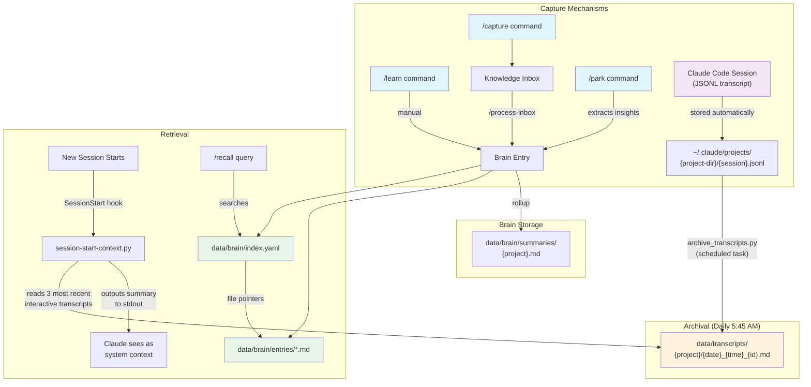

# Knowledge System

## Quick Reference

| Component | Location | Purpose |
|-----------|----------|---------|
| Brain (curated) | `data/brain/` | Cross-project persistent knowledge base |
| Transcript Archive | `data/transcripts/` | Verbatim session storage by project |
| SessionStart Hook | `~/.claude/hooks/session-start-context.py` | Auto-inject recent session context |
| Knowledge Inbox | `data/knowledge/inbox.md` | Quick-capture staging area |
| `/learn` | `~/.claude/commands/learn.md` | Manual brain entry creation |
| `/recall` | `~/.claude/commands/recall.md` | Brain search by tags/project/type |
| `/capture` | `.claude/commands/capture.md` | Quick inbox capture |
| `/process-inbox` | `.claude/commands/process-inbox.md` | Graduate inbox items to brain |
| `/park` | `.claude/commands/park.md` | Session-close with brain extraction |
| `/brain-status` | `.claude/commands/brain-status.md` | Brain entry dashboard |

**Current stats (as of 2026-04-09):** 52 brain entries across 8 projects, 6 project summaries, 257 archived transcripts across 8 project directories.

---

## Purpose

The knowledge system solves a structural problem in AI-assisted development: conversations vanish between sessions, and knowledge learned in one project is invisible when working in another.

Three layers address different failure modes:

1. **Brain** -- curated, deliberate knowledge (decisions, patterns, bug fixes). Captures **spec lineage**: what was decided and why.
2. **Transcript Archive** -- verbatim session storage. Captures **implementation lineage**: the small choices, dead ends, and mid-flight insights that don't trigger deliberate capture.
3. **SessionStart Hook** -- bridges sessions by injecting recent transcript context automatically. No behavior change required.

---

## Core Concepts

### Spec Lineage vs Implementation Lineage

The foundational insight behind this system (brain entry `2026-04-08-implementation-lineage-vs-spec-lineage`):

- **Spec lineage** = WHAT a system does. Board layouts, API contracts, architecture decisions. Captureable in deliberate docs and brain entries.
- **Implementation lineage** = HOW the spec became working code. Small UX choices, tried-and-rejected approaches, debugging dead ends. Lives in conversations and source code.

Manual capture (`/learn`, `/park`) requires recognizing what matters at the time. This works for spec lineage but fails for implementation lineage, where the important thing only becomes recognizable in hindsight. Verbatim transcript storage eliminates capture as a deliberate step.

### Design-for-Actual-Behavior Principle

The system avoids any mechanism that depends on "the user will remember to X." The typical workflow is: work until done, walk away, start fresh. All capture mechanisms are either deterministic (scheduled task polling) or zero-effort (SessionStart hook fires automatically).

---

## Mechanics / Flow



---

## Data Schemas

### Brain Entry Frontmatter

```yaml
---
id: YYYY-MM-DD-slug           # Unique identifier, date-prefixed
date: YYYY-MM-DD               # Creation date
type: insight                   # bug-fix | decision | pattern | insight | anti-pattern | reference
project: project-slug           # Primary project
related_projects: [slug1, slug2]  # Cross-project references (optional)
tags: [tag1, tag2, tag3]        # Searchable tags
related: [other-entry-id-1]    # Links to related brain entries (optional)
---
```

### Brain Entry Body

Each entry follows a standard structure (section names vary by type):

```markdown
# Title

## Context
What situation triggered this knowledge.

## Solution / Insight / Decision
The core content — what was learned, decided, or fixed.

## Key Lesson
The generalizable takeaway.

## Applies To
When future Claude should recall this entry.
Specific conditions, projects, or scenarios.
```

### Brain Index (`index.yaml`)

```yaml
last_updated: YYYY-MM-DD

entries:
  - id: 2026-03-17-cross-project-brain-architecture
    type: decision
    project: ai-assistant
    related_projects: []          # Optional
    tags: [architecture, knowledge-management, cross-project]
    summary: "One-line summary for search matching"
    file: entries/2026-03-17-cross-project-brain-architecture.md
```

### Transcript Archive File Structure

Each archived transcript is a markdown file at `data/transcripts/{project-slug}/{date}_{time}_{session-short-id}.md`:

```markdown
# Session: abcd1234

| Field | Value |
|-------|-------|
| Project | ai-assistant |
| Session ID | `abcdef01-2345-6789-abcd-ef0123456789` |
| Started | 2026-04-08 14:30 UTC |
| Ended | 2026-04-08 16:45 UTC |
| Messages | 42 |
| Raw size | 128,456 bytes |

---

## User

First user message...

## Assistant

First assistant response...

*[Tool: Read]*

## User

Next user message...
```

Long messages are truncated (user at 2,000 chars, assistant at 5,000 chars) to keep archives manageable.

### Archive Index (`data/transcripts/index.json`)

```json
{
  "archived": {
    "C--Users-yourname-projects-my-project/session-id.jsonl": "size:mtime_hash"
  },
  "last_run": "2026-04-09T10:45:00+00:00"
}
```

Tracks files by `{size}:{mtime_ns}` hash. Only new or modified files are processed on each run.

---

## System Integration

### Morning Pipeline

The transcript archive runs at 5:45 AM, before the briefing pipeline (reconciliation at 5:50, briefing assembly at 6:09). This ensures any overnight sessions are archived before the day starts.

### Reconciliation Engine

The reconciliation engine (`reconcile-tiers` task) reads the brain index when generating nudges. Brain entries tagged with a project's slug can surface relevant prior decisions during project status updates.

### SessionStart Hook

Registered globally in `~/.claude/settings.json` as a command hook on the `SessionStart` event:

- **Trigger:** Fires on every new session (`startup`, `clear` sources only)
- **Project detection:** Matches CWD folder name against `CWD_TO_PROJECT` mapping
- **Transcript selection:** Finds the 3 most recent interactive (non-automated) transcripts for the detected project
- **Automated session filtering:** Skips sessions containing markers like `<scheduled-task`, `gather-weather`, `assemble-briefing`, etc.
- **Output:** Compact summary printed to stdout, which Claude sees as system context

### `/park` Command

When the user closes a session intentionally, `/park` extracts brain-worthy insights from the conversation and creates brain entries before archiving the session context to `data/parked/`.

### Global CLAUDE.md

The global `~/.claude/CLAUDE.md` instructs Claude to consult the brain on session start: read `index.yaml`, search by tags/project/related_projects, and read matching entries for full detail.

### Claude Commands (Capture)

| Command | Scope | Location | Purpose |
|---------|-------|----------|---------|
| `/learn` | Global | `~/.claude/commands/learn.md` | Direct brain entry creation from any project |
| `/recall` | Global | `~/.claude/commands/recall.md` | Search brain by keywords, tags, project, type |
| `/capture` | Project | `.claude/commands/capture.md` | Quick-capture to knowledge inbox |
| `/process-inbox` | Project | `.claude/commands/process-inbox.md` | Curate inbox, graduate items to brain |
| `/park` | Project | `.claude/commands/park.md` | Session-close context save + brain extraction |
| `/brain-status` | Project | `.claude/commands/brain-status.md` | Dashboard of brain entries |

Global commands (`/learn`, `/recall`) live in `~/.claude/commands/` and work from any project directory. Project commands live in the AI Assistant repo's `.claude/commands/`.

---

## File References

### Brain

| File | Purpose |
|------|---------|
| `data/brain/index.yaml` | Master index -- tags, summaries, entry IDs, related projects |
| `data/brain/entries/` | Individual knowledge entries (one file per insight) |
| `data/brain/summaries/` | Per-project rollups grouping entries by type |

### Transcript Archive

| File | Purpose |
|------|---------|
| `data/transcripts/` | Root directory (subdirectories per project slug) |
| `data/transcripts/index.json` | Incremental archive tracking (size+mtime hashes) |
| `scripts/archive_transcripts.py` | JSONL-to-markdown conversion script |
| `scheduled-tasks/archive-transcripts.md` | Canonical scheduled task prompt |

### SessionStart Hook

| File | Purpose |
|------|---------|
| `~/.claude/hooks/session-start-context.py` | Hook script (reads transcripts, outputs context) |
| `~/.claude/settings.json` | Hook registration (SessionStart event) |

### Knowledge Capture

| File | Purpose |
|------|---------|
| `data/knowledge/inbox.md` | Raw capture inbox (links, thoughts, notes) |
| `.claude/commands/learn.md` | `/learn` command definition |
| `~/.claude/commands/recall.md` | `/recall` command definition (global) |
| `.claude/commands/capture.md` | `/capture` command definition |
| `.claude/commands/process-inbox.md` | `/process-inbox` command definition |
| `.claude/commands/park.md` | `/park` command definition |
| `.claude/commands/brain-status.md` | `/brain-status` command definition |

---

## Edge Cases and Limitations

### New Projects

Both `archive_transcripts.py` and `session-start-context.py` maintain hardcoded project maps (`PROJECT_MAP` and `CWD_TO_PROJECT` respectively). When a new project is added, both files must be updated or the project's transcripts will not be archived or surfaced.

### Historical Coverage

The transcript archive begins at 2026-03-11 (earliest archived session). Conversations before that date are not recoverable. The brain contains manually captured knowledge from earlier work, but implementation lineage from those sessions is lost.

### SessionStart Hook Timeout

The hook has a 10-second timeout. If the transcript directory grows very large or disk I/O is slow, the hook may be killed before completing. The current implementation limits scanning to `5 * limit` files (15 files checked to find 3 interactive sessions), which mitigates this.

### Automated Session Filtering

The SessionStart hook filters automated sessions by checking for marker strings in the first 2,000 characters. If a scheduled task prompt changes and no longer contains a recognized marker, its transcripts may incorrectly appear in session context. The marker list is maintained in `AUTOMATED_MARKERS` within the hook script.

### Cross-References

Brain entries with overlapping scope should use the `related` field in frontmatter to link to each other. This is a manual discipline -- there is no automated cross-reference validation.

### Inbox Accumulation

Items captured via `/capture` remain in `data/knowledge/inbox.md` until `/process-inbox` is explicitly run. There is no automated curation. Items tagged with `[brain]` during capture are routed directly to brain entries, bypassing the inbox.

### Transcript Cleanup Window

Claude Code's `cleanupPeriodDays` is set to 90 in `settings.json`. If this is reset to the default (30 days), source JSONL files may be deleted before the daily archive task processes them. The archive task runs daily, so this is only a risk if the setting is changed AND the archive task fails to run for 30+ consecutive days.

### Git-Ignored Data

The `data/` directory is gitignored. Brain entries, transcripts, and inbox contents are backed up to the NAS but are not in version control. Loss of the local filesystem without a NAS backup would lose all knowledge data.

---

## Future Extensions

### Vector Search Over Transcripts

The transcript archive in `data/transcripts/` is a plain-text corpus suitable for embedding. A future extension could index these files with ChromaDB or a similar vector store, enabling semantic search ("how did we handle auth token refresh in the security project?") rather than tag-based lookup.

### AI-Powered Session Review

A second scheduled task (or a PostCompact hook) could run AI review over newly archived transcripts and auto-generate brain entries for significant insights. This would bridge the gap between verbatim storage (captures everything) and curated knowledge (captures the important things) by automating the curation step.

### Cross-Project Transcript Search

Currently, the SessionStart hook only surfaces transcripts for the current project. A cross-project search capability would allow retrieving relevant sessions from other projects when the current task overlaps (e.g., searching agentic-security transcripts while working in rapid-cato).

### Transcript Summarization Layer

A compaction layer between raw transcripts and brain entries could produce per-session summaries: what was worked on, what was decided, what was left unfinished. These summaries would be cheaper to search than full transcripts while preserving more detail than brain entries.

---

## Revision History

| Date | Change |
|------|--------|
| 2026-04-09 | Initial version documenting all three layers of the knowledge system |
